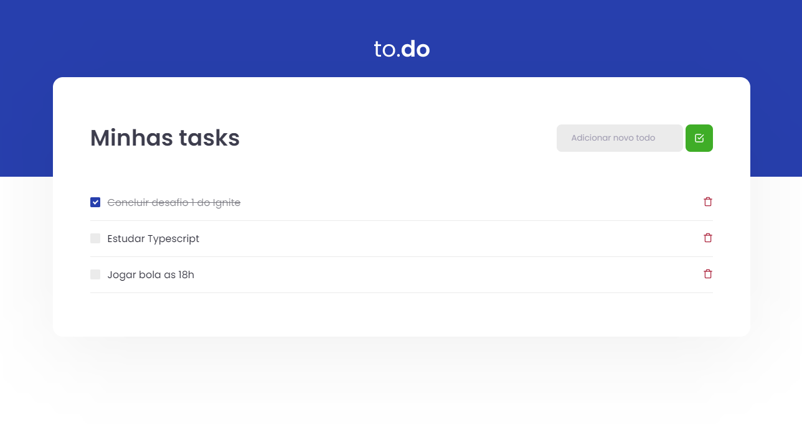

# To.do

<h1 align="center">
    
</h1>

## Objetivo do projeto
Nesse desafio, você deverá criar uma aplicação para treinar o que aprendeu até agora no ReactJS. Essa será uma aplicação onde o seu principal objetivo é uma pequena aplicação de atividades a fazer, para treinar um pouco mais sobre manipulação do estado no React.

## 🧪 Tecnologias

O projeto foi desenvolvido usando as tecnologias abaixo:

- [React](https://reactjs.org)
- [TypeScript](https://www.typescriptlang.org/)

## 🚀 Como rodar

Clone o projeto e acesse a pasta dele:

```bash
$ git clone https://github.com/pedropaulodf/ignite-chapter1-desafio-principal && cd ignite-chapter1-desafio-principal
```

Depois de acessada a pasta, rode os comandos abaixo:
```bash
# Instalar as dependências
$ yarn

# Estartar o projeto
$ yarn dev
```
